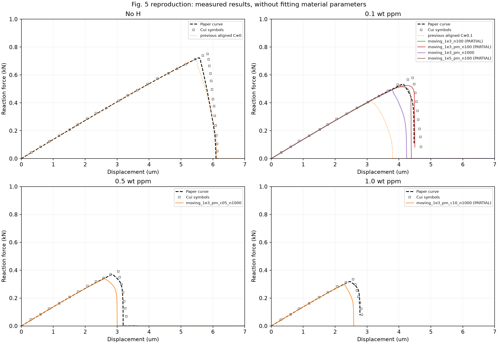

# Díaz 2025 Part II 仿真复现阶段报告

编制日期：2026年10月1日（北京时间）。本报告为结果快照，最新已落盘求解结果时间为2026年9月30日14:39；不包含尚未生成结果文件的试算。

## 1. 总体结论

目前尚不能宣布论文实验复现成功。已完成无氢基准，以及修正配置下293 K、0.1和0.5 wt ppm的完整加载计算。无氢峰值误差为−1.61%；两组含氢完整结果的峰值仍分别低8.22%和8.33%，共同参考区间的曲线误差约21.33%和19.52%。1.0 ppm试算在断裂阶段发生求解失败，只取得部分解。

修正明显改善了旧含氢结果的偏差，但粗步长下看似接近论文的峰值不能作为成功依据：同一0.1 ppm配置细化步长后，最大载荷由0.524256降至0.490841 kN。时间离散敏感性尚未消除。作者模型采用300 K，而论文通用参数表采用293 K；300 K耦合求解尚无最终结果，不能用理论估算替代。

## 2. 复现范围与配置

对象为 Andrés Díaz 等的《A COMSOL framework for predicting hydrogen embrittlement, Part II: Phase field fracture》，限定于§4.1.1 / Fig. 5的开裂板数值验证。比较对象是论文作者曲线，不将Cui等的符号数据混作同一参考。该报告不代表边界层、三维容器及其他算例已完成复现。

| 参数 | 当前细步长含氢试算 |
|---|---|
| 软件 | COMSOL 6.4、MATLAB R2025b；作者模型来源为COMSOL 6.2 |
| 几何与加载 | 1 mm板、半长裂纹；位移加载至7 µm |
| 弹性与断裂参数 | E=210 GPa，ν=0.3，Gc0=2700 J/m²，lc=0.0075 mm |
| 网格与阶次 | 20282个域单元；局部尺寸lc/5；位移/相场三阶、浓度一阶 |
| 氢浓度 | 0.1、0.5、1.0 wt ppm |
| 温度 | 已有正式结果为293 K；300 K对照尚未完成 |
| 移动化学边界 | kmovBCs=1000，平滑启用扩散增强 |
| 压力驱动 | −solid.pm/Sy0；与速度表达式中的Sy0抵消 |
| 时间求解 | BDF自由步长，最大步长为总时长/1000；单程交错 |
| 容差与输出 | Fig. 5指定相对容差0.005；1001个输出点 |

输出点数量不等于内部求解步数。无氢基准复用先前已完成的对齐计算，不冒充本次新运行。

## 3. 结果总表

| 工况 | 加载状态 | 论文峰值/kN | 计算最大载荷/kN | 对应位移/µm | 最大载荷偏差 | 共同区间 NRMSE | 最后位移/µm |
|---|---|---:|---:|---:|---:|---:|---:|
| 无氢基准 | 完整 | 0.723681 | 0.712054 | 5.474 | -1.61% | 2.75% | 7.000 |
| 旧含氢基准 | 完整 | 0.534825 | 0.411087 | 3.136 | -23.14% | 38.53% | 7.000 |
| 修正细步长 0.1 ppm | 完整 | 0.534825 | 0.490841 | 3.780 | -8.22% | 21.33% | 7.000 |
| 修正细步长 0.5 ppm | 完整 | 0.368997 | 0.338265 | 2.611 | -8.33% | 19.52% | 7.000 |
| 修正细步长 1.0 ppm | 部分解 | 0.318445 | 0.296523 | 2.289 | -6.88% | 9.75% | 2.583 |
| 修正粗步长 0.1 ppm | 部分解 | 0.534825 | 0.524256 | 4.235 | -1.98% | 4.29% | 4.498 |
| 增强倍率 10⁵ 粗步长 | 部分解 | 0.534825 | 0.514572 | 4.095 | -3.79% | 3.41% | 4.389 |
| 仅增强扩散、保留 pGp | 部分解 | 0.534825 | 0.399424 | 3.013 | -25.32% | 0.23% | 3.013 |

部分解的“最大载荷”仅指已观测最大值，不保证是完整加载的全局峰值。所有误差均相对于数字化论文作者曲线；数字化本身存在未量化的读图误差。NRMSE在共同位移区间的等间距网格上计算，并以论文峰值归一化。部分解的区间更短，误差不可与完整曲线直接排名；例如仅算至3.013 µm的曲线尚未覆盖断裂阶段，其0.23%的误差不代表复现良好。

图1：各浓度的论文参考与已保存计算曲线。PARTIAL表示加载未完成；诊断曲线与完整结果同时展示，用于解释偏差，不能择优挑选曲线宣布成功。

## 4. 已发现问题及实施修正

1. **移动化学边界未启用。** 原模型kmovBCs=0，扩散增强项不起作用；新试算显式设置非零倍率。增强在相场φ=0.5至1之间平滑开启，不能视为φ刚超过0.5就强制浓度等于环境值。
2. **压力表达式需要对照。** 原件使用solid.pGp，论文实现描述使用solid.pm。新试算采用后者，但尚未通过完整单因素组隔离其影响；不将pGp简单解释为“未损伤应力”。
3. **旧极值统计范围不完整。** 原后处理选择部分域，现改为全域，同时记录极值位置及同位置的相场、覆盖度和韧度，避免拼接不同位置或不同温度的数据。
4. **单位、图表和完成判据已纠正。** 位移明确为µm；新图读取最新结果；以是否达到7 µm判断完整加载，而不是仅看求解接口是否返回成功。
5. **保留失败与中断证据。** 原模型、历史结果和中断日志均保留；续算记录恢复时间，并检查恢复点附近曲线连续性。续算耗时不能冒充整次总耗时。

## 5. 场量与数值稳定性证据

旧0.1 ppm含氢解在载荷峰值时，全域最大浓度为2.284863 mol/m³，约为初始值的2.93倍。该位置φ=0.397159，覆盖度0.783282，Gc/Gc0=0.302879。此前将旧富集倍数与另一温度的初始覆盖度并列解释的口径已纠正。

修正后的0.1 ppm粗步长试算，在峰值时裂尖路径φ>0.95的13个采样点上，C/C0为1.000000–1.003013，说明接近完全断裂区域浓度已接近环境值；但φ>0.5区域仍有最高约1.1452的比值，不能推广为整个损伤区都满足该条件。

0.1与0.5 ppm细步长计算曾出现约10⁻⁷ s的极小内部步长，随后自行恢复并完成加载。因此极小步长本身不构成“必然失败”的证据。1.0 ppm则实际报出重复误差测试失败、末步不收敛，终止于2.583006 µm；不能因末载荷已很小就标记完整。倍率10⁵的0.1 ppm粗步长试算也实际失败，终止于4.389403 µm。

## 6. 温度差异：重要线索，尚未验证

采用均匀浓度C=C0的理想化假设，按√(Gc/Gc0)缩放无氢响应，300 K下三组含氢峰值估算误差约为+0.69%、−0.10%、−0.83%；293 K下约为−5.09%、−6.65%、−6.02%。

这项计算仅支持优先检查作者原件的300 K设置。它未求解应力驱动输运，也不保证离散求解满足严格缩放关系；不是300 K仿真结果，不可用于宣称四浓度复现完成。

## 7. 尚未完成的工作与验收条件

本次核查未发现活动的MATLAB或COMSOL求解进程。以下任务在队列中但尚无最终结果文件：300 K的0.1/0.5/1.0 ppm组、倍率10⁷试算，以及压力变量和移动边界的补充单因素对照。排入队列不等于已经运行完成。

下一步应先完成作者原件300 K的三浓度耦合计算，并解决1.0 ppm后峰求解失败；随后固定物理参数，检查时间步长、网格和扩散增强倍率敏感性。容差终止或多次交错可作为稳定性诊断，但需与论文单程算法明确区分。

验收至少要求：四浓度全部具有完整加载数据；峰值、峰值位移和后峰形状均与同一论文参考比较；数值细化不再导致实质性变化；裂纹区域浓度和场量满足模型定义；所有失败和参数来源可追溯。目前尚未达到这些条件。

## 8. 附件与可追溯性

- `evidence/repair_comparison.json`：每条曲线的峰值、共同区间和误差。
- `evidence/repair_validation.json`：数据完整性及恢复点检查。
- `evidence/temperature_scaling_diagnostic.json`：独立理论估算，非耦合仿真。
- `evidence/repair_*.json`：已保存试算结果及实际配置；历史基准原始指标一并提供。
- `manifest.json`：本报告证据文件的SHA-256校验值。
- `report.html`：内嵌对比图的单文件阅读版本，可用浏览器打印。

作者原始模型SHA-256：`b22a2d540806e6a1e701d6948bb27c7bbcf640ba35f767c2988ca1efe15a27e4`。本次云端报告不包含大型求解模型或论文全文。模型与完整日志保留在本地项目目录，云端附件足以核查本报告所列曲线和统计值，但不是完整求解环境。
