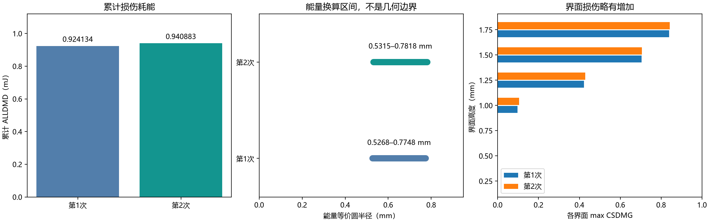

# 107 个大型仿真文件：结果总结与过程动画

本报告对应未上传清单中的 **107 个文件，合计 87.350 GiB，归属于 35 个 Abaqus 作业**。同一作业的 ODB 与续算文件不重复算成独立试验。

文件构成为 30 个 ODB、35 个 ABQ、31 个 PAC、11 个 STT。ODB 提供可读回的场/历史结果；其余为求解器状态与打包辅助文件等，不逐个制作重复动画。报告以同名 ODB 的导出数据、已校验结果 JSON 和权威交接文档为依据，并未把内部状态文件当成独立物理结果重新求解。

**交付：34 个作业 GIF + 1 个两次冲击全过程汇总 GIF，共 35 个 GIF。** 原始文件保持不变；这些紧凑成果不能替代 ODB 和 restart 原始状态，也不能单凭 GIF 在云端续算。

## 1. 当前最重要的结论

两次同点约 0.300 J 落球均完成，第三次未运行。累计 ALLDMD 从 0.924134 增至 0.940883 mJ，第二次新增 0.016749 mJ，相对增加 1.81%。这是当前数值模型下的小幅累积，不能凭两次结果认定损伤饱和，也不能外推实际疲劳寿命。

[播放两次冲击全过程](gifs/repeat_030J_two_hits.gif)：第1次冲击 → 数值消振 → 球复位 → 入射速度准备 → 第2次冲击。段落保留各分析步的局部物理时间；各段以同样帧播放时长展示，不意味着真实等待时间相同。

| 次数 | 累计 ALLDMD / mJ | 本次增量 / mJ | 能量等价半径 / mm | 峰值力 / N | 最大向下位移 / µm | 反弹比 |
|---|---:|---:|---|---:|---:|---:|
| 1 | 0.924134 | 0.924134 | 0.5268–0.7748 | 568.595 | 782.126 | 0.77024 |
| 2 | 0.940883 | 0.016749 | 0.5315–0.7818 | 569.776 | 781.001 | 0.77016 |

数据来源：`simulation_reproduction/impact_wave_3d/repeat_impact_summary.json`，由 Abaqus ODB 读数器完成全阶段连续性与能量检查；本报告复用已校验的数值，不把 GIF 抽帧峰值代替历史输出峰值。

## 2. 分层 footprint 与中间阶段

两次冲击后均有 4 个受损界面。下面面积是节点控制面积的阈值估计，各界面不可简单视为同一圆形损伤区。

| 界面高度 / mm | 第1次 max D | 第2次 max D | 第1次 D>0.01 面积 / mm² | 第2次 D>0.01 面积 / mm² | 第2次最远受损半径 / mm |
|---|---:|---:|---:|---:|---:|
| 0.250 | 0.000000 | 0.000000 | 0.000000 | 0.000000 | 0.000000 |
| 0.500 | 0.000000 | 0.000000 | 0.000000 | 0.000000 | 0.000000 |
| 0.750 | 0.000000 | 0.000000 | 0.000000 | 0.000000 | 0.000000 |
| 1.000 | 0.097849 | 0.104173 | 1.287485 | 1.327436 | 1.259346 |
| 1.250 | 0.422423 | 0.428260 | 4.601174 | 4.601174 | 1.507201 |
| 1.500 | 0.704295 | 0.705353 | 4.998386 | 4.998386 | 1.507201 |
| 1.750 | 0.839708 | 0.842768 | 5.092942 | 5.092942 | 1.507201 |

两次冲击的 D≥0.95 面积均为 0；存在局部部分损伤，并不等于出现完全断开的圆孔。第二次主要体现既有区域的损伤程度增加，1.000 mm 界面的阈值面积略有扩展。

消振末段板机械能为 1.56146e-5 J、最大速度 0.0226034 m/s，通过所设静止判据。消振、复位和入射准备三个阶段 ALLDMD 增量均为 0；不能把球准备过程的动能增长误认为板损伤增长。

## 3. 其他作业应如何解释

- 当前单次标定 `imp_lo / imp_mid / imp_hi`：0.100 / 0.300 / 0.794 J，交接文档记录 ALLDMD 约 0.0966 / 0.9267 / 15.11 mJ；用于单次能量对照，不是三次累积。
- 当前导波 `wav_base / wav_d03_r08 / wav_d08_r31`：无损、0.8 mm、3.1 mm 预置脱黏对照；交接文档记录两档 R1/R2 为 0.0547/0.0463 与 1.50/1.33。这些导波不是第二轮冲击后新跑的结果。
- `grade_*`、`impact_*`、`wave_*`、`wav_d03 / wav_d08` 等为早期网格或参数对照；旧半径导波不能替代修正半径版本。
- `kdef / kply_* / ksoft`、`scope_*` 为界面刚度、接触范围和数值稳定性对照。默认刚度的失稳机制仍未查清；成功结束不等于物理或数值验收合格。
- `interrupted_20260923_133902/acc_n02_relax1` 是中断归档，仅作诊断；对应完整消振作业位于父目录，已另列动画。
- `grade` 虽有求解成功标记，但仅有不足两帧的场输出，无法制作真实过程 GIF。未伪造动画。

## 4. 必须随结果保留的限制

材料强度、断裂能采用有出处的替代值：朱国华等，复合材料学报 40(6), 3626–3639 (2023)，DOI 10.13801/j.cnki.fhclxb.20220720.002；并非本试件实测标定。接触型黏聚刚度显式取 2.37e13 Pa/m。

冲击应力场未收敛，界面刚度带来约两倍面积敏感性；未与实物实验验证。数值消振参数与静止判据为工程假设，阻尼敏感性尚未完成。小半径导波存在冲击 4 个受损界面与导波 5 个预置界面的映射差异。

ALLDMD/Gc 得到跨界面汇总的完全断裂能量等价面积；部分损伤也贡献耗能。因此等价圆半径区间不是几何损伤半径的严格上下界，不能复制到每一个界面。

GIF 仅展示已保存数值场，最多选取每步 51 帧、每帧 150 ms；导波场可能抽取显示节点。单段色标固定，跨图/跨段可能不同。位移场和能量不是 PZT 电压；多段拼接只用于展示，不会生成新的物理解。

## 5. 35 个作业及 GIF 索引

数值列来自各步已导出的 ODB 历史/场记录。U3 峰值仅指抽取帧与显示顶面节点中的最大绝对值，不是严格全场或冲击中心时程峰值。

| 作业（目录用于区分重名） | 大文件数 | GiB | 状态 | 过程 GIF |
|---|---:|---:|---|---|
| accum_030j_3/acc_n01 | 4 | 4.477 | 求解完成 | [播放](gifs/acc_n01__0a0d2561.gif) |
| accum_030j_3/acc_n02 | 4 | 7.129 | 求解完成 | [播放](gifs/acc_n02__29a03e4e.gif) |
| impact/imp_hi | 4 | 2.609 | 求解完成 | [播放](gifs/imp_hi__14315861.gif) |
| impact/imp_lo | 4 | 2.609 | 求解完成 | [播放](gifs/imp_lo__545c8666.gif) |
| impact/imp_mid | 4 | 2.609 | 求解完成 | [播放](gifs/imp_mid__aeca0372.gif) |
| impact/wav_base | 3 | 2.319 | 求解完成 | [播放](gifs/wav_base__bd33f763.gif) |
| impact/wav_d03_r08 | 3 | 2.318 | 求解完成 | [播放](gifs/wav_d03_r08__99235604.gif) |
| impact/wav_d08_r31 | 3 | 2.320 | 求解完成 | [播放](gifs/wav_d08_r31__c1828585.gif) |
| accum_030j_3/acc_n02_prepare | 4 | 5.842 | 求解完成 | [播放](gifs/acc_n02_prepare__238b4439.gif) |
| accum_030j_3/acc_n02_relax1 | 4 | 3.454 | 求解完成 | [播放](gifs/acc_n02_relax1__e4e25936.gif) |
| impact/grade_hi | 3 | 2.538 | 求解完成 | [播放](gifs/grade_hi__70d6cd4d.gif) |
| impact/grade_lo | 3 | 2.538 | 求解完成 | [播放](gifs/grade_lo__b3011418.gif) |
| impact/grade_mid | 3 | 2.538 | 求解完成 | [播放](gifs/grade_mid__def883ea.gif) |
| impact/impact_big | 3 | 2.097 | 求解完成 | [播放](gifs/impact_big__715c02e3.gif) |
| impact/impact_dmg | 3 | 2.097 | 求解完成 | [播放](gifs/impact_dmg__9d706c70.gif) |
| impact/impact_full | 3 | 2.097 | 求解完成 | [播放](gifs/impact_full__c3cbe787.gif) |
| impact/impact_hi | 4 | 4.126 | 求解完成 | [播放](gifs/impact_hi__8f7d2f56.gif) |
| impact/impact_lo | 4 | 4.126 | 求解完成 | [播放](gifs/impact_lo__f6d62dad.gif) |
| impact/impact_mid | 4 | 4.126 | 求解完成 | [播放](gifs/impact_mid__cb877aad.gif) |
| impact/kdef | 3 | 2.091 | 求解完成 | [播放](gifs/kdef__b37dbd9d.gif) |
| impact/kply_ply | 3 | 2.091 | 求解完成 | [播放](gifs/kply_ply__b9ead21f.gif) |
| impact/kply_smoke | 1 | 0.361 | 求解完成 | [播放](gifs/kply_smoke__4ae390bf.gif) |
| impact/kply_stiff | 3 | 2.091 | 求解完成 | [播放](gifs/kply_stiff__b289d3c3.gif) |
| impact/ksoft | 3 | 2.091 | 求解完成 | [播放](gifs/ksoft__05705774.gif) |
| impact/scope_impact | 3 | 0.713 | 求解完成 | [播放](gifs/scope_impact__c1c01f7d.gif) |
| impact/scope_smoke | 1 | 0.361 | 求解完成 | [播放](gifs/scope_smoke__e25e12ff.gif) |
| impact/wav_d03 | 3 | 2.320 | 求解完成 | [播放](gifs/wav_d03__e6a66468.gif) |
| impact/wav_d08 | 3 | 2.322 | 求解完成 | [播放](gifs/wav_d08__26724154.gif) |
| impact/wave_base | 3 | 2.317 | 求解完成 | [播放](gifs/wave_base__9d0b4a49.gif) |
| impact/wave_d03 | 3 | 2.318 | 求解完成 | [播放](gifs/wave_d03__0ebee02b.gif) |
| impact/wave_d08 | 3 | 2.320 | 求解完成 | [播放](gifs/wave_d08__e57e0308.gif) |
| impact/wave_dp | 1 | 0.373 | 求解完成 | [播放](gifs/wave_dp__05ab1b4e.gif) |
| impact/wave_smoke | 1 | 0.231 | 求解完成 | [播放](gifs/wave_smoke__2b6741ed.gif) |
| interrupted_20260923_133902/acc_n02_relax1 | 4 | 2.817 | 中断/未完成 | [播放](gifs/acc_n02_relax1__3c604fe9.gif) |
| impact/grade | 2 | 0.562 | 求解完成 | 缺少过程帧 |

## 6. 按分析步的直接读数

| 作业 / 分析步 | 物理时间范围 / µs | 显示帧 / 保存帧 | ALLDMD 末值 / mJ | 抽样顶面 max abs U3 / µm |
|---|---|---|---:|---:|
| accum_030j_3/acc_n01 / IMPACT | 0.000–500.000 | 51/51 | 0.924134 | 781.058 |
| accum_030j_3/acc_n02 / acc_n02 | 0.000–500.000 | 51/51 | 0.940883 | 780.416 |
| impact/imp_hi / IMPACT | 0.000–500.000 | 26/26 | 15.1088 | 1272.82 |
| impact/imp_lo / IMPACT | 0.000–500.000 | 26/26 | 0.0966118 | 455.179 |
| impact/imp_mid / IMPACT | 0.000–500.000 | 26/26 | 0.926688 | 781.064 |
| impact/wav_base / WAVE | 0.000–250.000 | 26/26 | 0 | 0.333109 |
| impact/wav_d03_r08 / WAVE | 0.000–250.000 | 26/26 | 0 | 0.333232 |
| impact/wav_d08_r31 / WAVE | 0.000–250.000 | 26/26 | 0 | 0.453944 |
| accum_030j_3/acc_n02_prepare / acc_n02_prepare_POSITION | 0.000–100.000 | 11/11 | 0.924134 | 2.76965 |
| accum_030j_3/acc_n02_prepare / acc_n02_prepare_LAUNCH | 0.000–50.000 | 11/11 | 0.924134 | 1.13942 |
| accum_030j_3/acc_n02_relax1 / acc_n02_relax1 | 0.000–500.000 | 11/11 | 0.924134 | 309.015 |
| impact/grade_hi / IMPACT | 0.000–500.000 | 26/26 | 26.7344 | 1251.87 |
| impact/grade_lo / IMPACT | 0.000–500.000 | 26/26 | 0.358094 | 442.965 |
| impact/grade_mid / IMPACT | 0.000–500.000 | 26/26 | 1.87999 | 760.786 |
| impact/impact_big / IMPACT | 0.000–700.000 | 51/51 | 1.3295 | 1208.11 |
| impact/impact_dmg / IMPACT | 0.000–700.000 | 51/51 | 0 | 169.995 |
| impact/impact_full / IMPACT | 0.000–300.000 | 51/51 | 0 | 107.587 |
| impact/impact_hi / IMPACT | 0.000–500.000 | 26/26 | 30.2519 | 1253.48 |
| impact/impact_hi / WAVE | 0.000–250.000 | 26/26 | 30.2519 | 652.069 |
| impact/impact_lo / IMPACT | 0.000–500.000 | 26/26 | 0.361339 | 442.916 |
| impact/impact_lo / WAVE | 0.000–250.000 | 26/26 | 0.361339 | 235.702 |
| impact/impact_mid / IMPACT | 0.000–500.000 | 26/26 | 1.90354 | 760.86 |
| impact/impact_mid / WAVE | 0.000–250.000 | 26/26 | 1.90354 | 406.092 |
| impact/kdef / WAVE | 0.000–100.000 | 11/11 | 0 | 0.333109 |
| impact/kply_ply / WAVE | 0.000–100.000 | 11/11 | 0 | 0.3388 |
| impact/kply_smoke / WAVE | 0.000–20.000 | 5/5 | 0 | 0.230848 |
| impact/kply_stiff / WAVE | 0.000–100.000 | 11/11 | 0 | 0.286663 |
| impact/ksoft / WAVE | 0.000–100.000 | 11/11 | 0 | 0.932782 |
| impact/scope_impact / IMPACT | 0.000–120.000 | 7/7 | 0 | 693.538 |
| impact/scope_impact / WAVE | 0.000–250.000 | 26/26 | 0 | 749.037 |
| impact/scope_smoke / WAVE | 0.000–100.000 | 11/11 | 0 | 0.225991 |
| impact/wav_d03 / WAVE | 0.000–250.000 | 26/26 | 0 | 0.333236 |
| impact/wav_d08 / WAVE | 0.000–250.000 | 26/26 | 0 | 0.498078 |
| impact/wave_base / WAVE | 0.000–250.000 | 26/26 | 0 | 0.290245 |
| impact/wave_d03 / WAVE | 0.000–250.000 | 26/26 | 0 | 0.290128 |
| impact/wave_d08 / WAVE | 0.000–250.000 | 26/26 | 0 | 0.332286 |
| impact/wave_dp / WAVE | 0.000–100.000 | 11/11 | 0 | 0.226716 |
| impact/wave_smoke / WAVE | 0.000–100.000 | 11/11 | 0 | 0.227805 |
| interrupted_20260923_133902/acc_n02_relax1 / acc_n02_relax1 | 0.000–300.000 | 7/7 | 0.924134 | 309.015 |

## 7. 文件与追溯

`large_file_manifest.json` 覆盖每一个待上传大文件及其所属作业、原始路径、大小、GIF 和读数来源；`repeat_impact_summary.json` 保存本轮正式读数副本。HTML 报告可直接播放动画，Markdown 便于其他 agent 引用。原始 87.35 GiB 文件仍保留本地，未删除或压缩替代。
