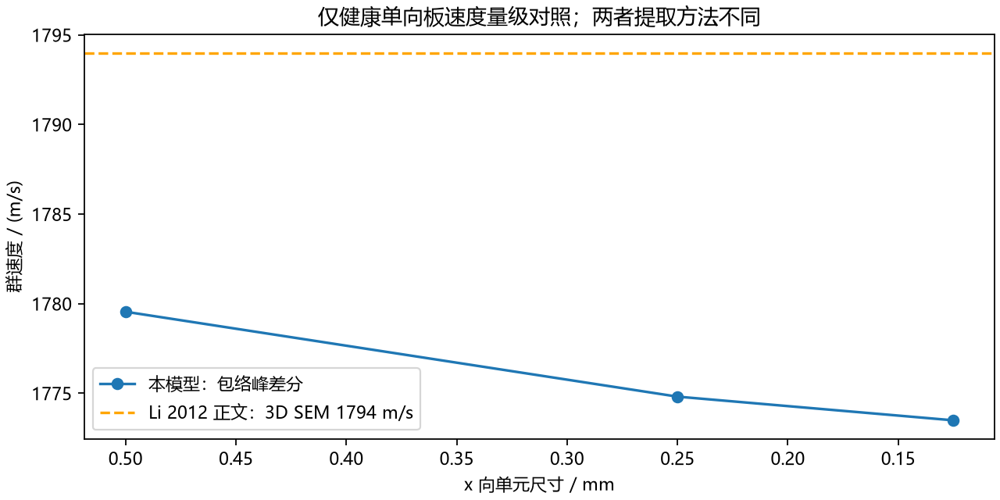
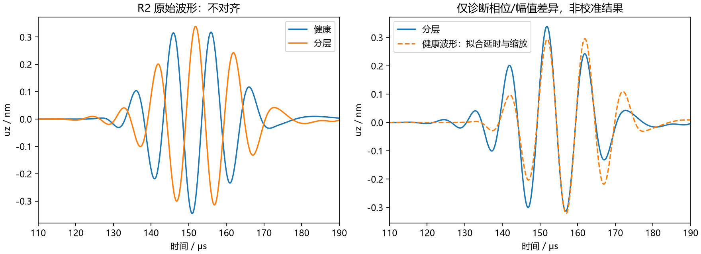
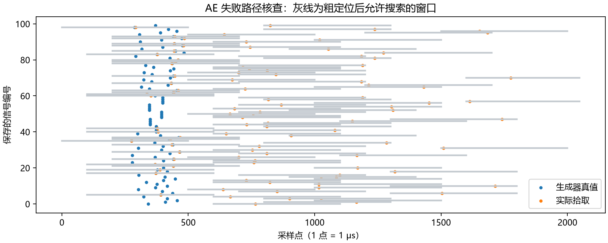
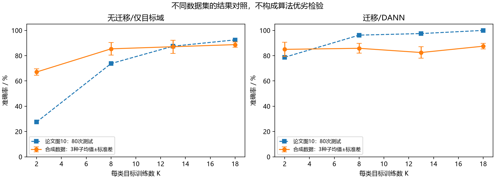
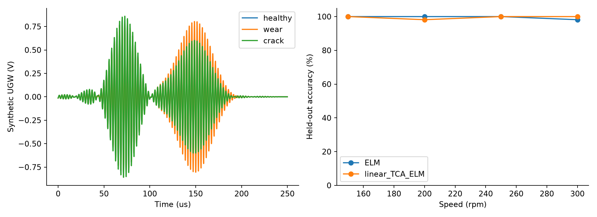
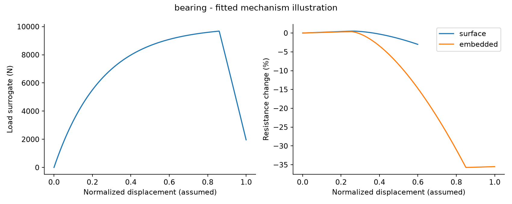
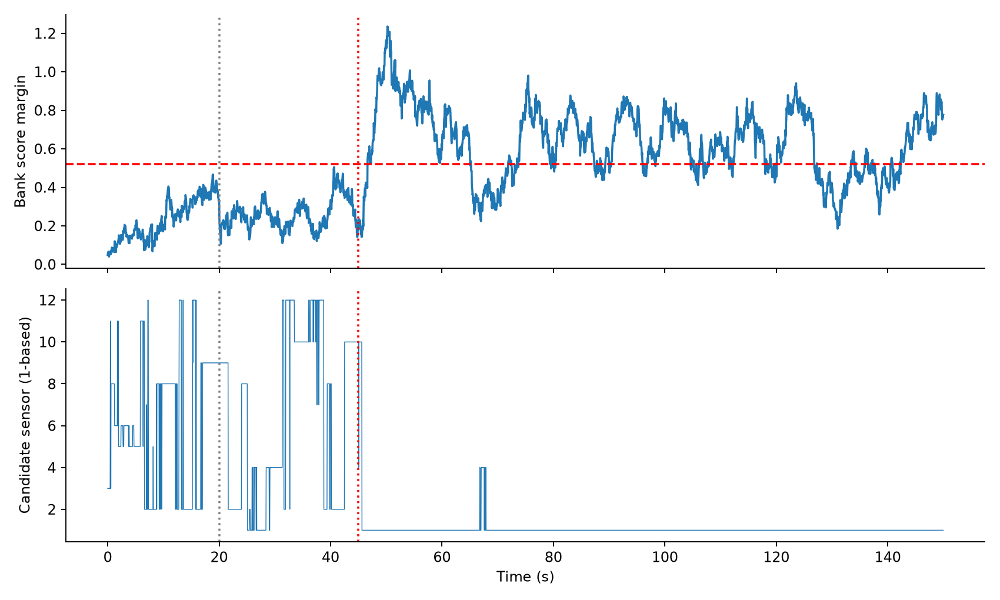

# 论文与仿真逐项对比分析

> GitHub阅读版：保留完整分析及本项目绘图；原论文图页仅保存在本机完整版，以下相应位置标明本地附件名。

分析日期：2026-09-15。对象为 D:/bs_thesis/simulation_reproduction 中的既有输出及 guided_wave_v2；本次另做了可复算的窗口审计、波形配准诊断、逐种子差值和论文混淆矩阵算术核查。没有重写原有数据来追求与论文一致。

## 1. 先给出审查结论

现有成果中，**没有一组已经具备“同一试件、同一输入、同一传感输出、同一评估协议”的完整实验验证条件**。所以不能对全部图表统一计算一个“复现误差”。本报告仍然给出能成立的数值差异，并把原因追踪到具体代码、数据记录和论文位置。

最重要的发现有六项：

1. 新版导波的健康波包速度为 1773.48 m/s，相对外部参考论文的 1794 m/s 低 1.14%。但铺层、维数、激励量纲和测点不一致，使分层散射波形不能直接逐点对照，更不能把这一速度差当作整个模型的验证误差。
2. AE 保存的 100 条 0 dB 信号中，71 条误拾取全部可以追踪到粗定位窗口排除了真值；本次逐条记录证明这一失败路径，而非仅猜测“噪声太大”。
3. DANN 在 K=13 和 K=18 时，相对混合监督基线的下降在三个种子上都出现；“添加域对抗一定改善迁移”不成立于当前实现和当前数据。
4. 旧循环压力代码的输入是 1600 kPa，而 P5 原文为 160 kPa，存在明确的十倍输入错误。旧版关于这项复现的表述应纠正。
5. P4 齿轮论文图 13 的混淆矩阵重算平均准确率为 93.21%，正文为 92.36%；两处口径未能对应，不能擅自合并为唯一基准。
6. P2 数学蒙特卡洛图注写“10 thousands tests”，即每档 10000 次；旧报告把本程序的 100000 次称为沿用原文数量不准确。

### 证据标记

| 等级 | 本报告含义 | 可以得出的结论 |
|---|---|---|
| E1 原文证据 | PDF 原图、表格、明确文字；外部出版社正文 | 原文究竟写了什么，不自动保证原文各处自洽 |
| E2 计算证据 | 读取实际数组、代码定义、重新计数或同输入诊断 | 当前程序究竟算了什么、哪些差异可重复 |
| E3 解释边界 | 根据方程确定缺少某项物理，但尚未做对照求解 | 可以指出不可比原因，不能给该原因分配误差百分比 |

“原文与程序设置不同”是可核实事实；“这个设置导致全部差距”则需要控制变量实验，不能混为一谈。

## 2. 图表对应关系与可比性

| 组别 | 论文图/表 | 本项目图/数据 | 可比较程度 |
|---|---|---|---|
| 新版导波 | Li 2012 §4.1 图5–6；§4.2 图13–16 | experiment-results.png、wave-space-time.png、接收 NPZ | 健康单向板速度量级；损伤现象定性，不是同工况波形 |
| P1 AE | MSSP01，PDF p12–13，表3–4、图12–14 | ae_accuracy.png、ae_example.png、ae_trials.json | 阈值定义可对齐；样本、SNR与对照算法不一致 |
| P2 定位数学实验 | SMS论文01，PDF p12–13，图13–14 | localization_sensitivity.png、localization_heatmap.png | 无量纲扰动趋势部分可比；失败处理不同 |
| P2 结构响应 | PDF p15–18 的蜂窝板模型及网格研究 | plate_convergence.png、plate_waveforms.npz | 模型、约束、输出不同，不能当成同一网格收敛图 |
| P3 小样本迁移 | Zhao，PDF p11，表2、图10 | transfer.png、transfer_trials.json | 样本数和准确率定义可对齐；数据集不同 |
| P4 齿轮诊断 | PDF p8–9，图10–15 | gear.png、gear_summary.json | 算法链、测试集和信号来源不同；原文内部还有数值矛盾 |
| P5 表贴压阻 | PDF p7，图13–16、表II | joint_surrogates.npz 中循环曲线 | 输入检查；不能作传感器本构验证 |
| P6 嵌入压阻 | PDF p11，图24–26、表III | joint_*.png、joint_anchors.json | 文献值被用作模型输入，不是独立预测 |
| P7 发动机 | PDF p6 的模式识别、p8 图14–16 | faults.png、faults_summary.json | 仅故障注入/滤波器思路对照，指标不等价 |

所有 PDF 页码均指阅读器页序。例如 Zhao 的 PDF 第11页印刷页码为10，避免检索时错位。

## 3. 新版导波：相似之处、不同之处与原因证据

### 3.1 先纠正“论文实验”的性质

外部参考 [Li 等（2012）](https://onlinelibrary.wiley.com/doi/10.1155/2012/659849) 这里对应的是数值研究及解析比较，不是实体 PZT 台架实测。其健康基准包含单向板，其分层案例采用准各向同性板；给出的 x 向单向板 SEM 群速度是 1794 m/s。参数及图号依据出版社正文 §4、表1、§4.1–4.2。出版社 PDF 下载本次返回 403，未取得原始数字波形；本报告未伪造该论文曲线，也未声称已数字化其图15。

本模型读取文献材料常数，但选择 [0]8 二维截面、两个观察点及中面分层。它不是把论文三维损伤案例原封不动重跑。知识库内的钢齿轮主动导波、被动冲击、被动 AE 也不能替代这个 CFRP 分层案例的验证数据。

### 3.2 健康传播速度的定量对照

本次统一使用 Hilbert 包络主峰：R1 取45–100 μs，R2取110–180 μs；c_g=0.14 m/(t_R2−t_R1)。窗口在三档网格中固定，没有逐档调参追逐文献值。

| 网格 | R1峰时刻/μs | R2峰时刻/μs | 本模型速度/(m/s) |
|---|---:|---:|---:|
| 1000×8 | 71.6812 | 150.3531 | 1779.54 |
| 2000×16 | 71.8537 | 150.7356 | 1774.81 |
| 4000×32 | 71.9215 | 150.8622 | 1773.48 |

相对文献1794 m/s的有符号差为−20.52 m/s，即−1.14%。中→细网格速度变化约−0.075%，而且加密并没有把速度推向1794：这直接否定了“只要继续加密，速度一定会与论文一致”的说法。速度提取方法、二维约束和三维传播等仍然不同；没有相同模型的解析频散解，无法将剩余差距具体分解给各因素。文献速度本身是数值结果，也不是无误差的实测真值。[来源：Li 2012 §4.1](https://onlinelibrary.wiley.com/doi/10.1155/2012/659849)

**速度量级接近不等于波形收敛。** 损伤波形中→细网格相对L2变化为R1 6.18%、R2 10.11%；粗→中为23.09%、36.33%。中等网格时间步减半仅变化0.0476%、0.0506%。E2证据支持：在所检查的离散范围内，空间加密改变波形远多于时间步减半；不能将剩余波形差异主要归结为时间步。也不能据此声称最终空间误差恰好就是6%或10%，因为最细网格并不是真解。

### 3.3 为什么 R2 的差分看起来很大

原始数据中健康R2绝对峰值0.3456 nm，差分峰值0.6589 nm。差分是u_damage−u_healthy，两个相位不同的信号相减可以超过各自幅值。因此0.6589/0.3456不是散射能量系数，更不是损伤程度。

为检验相位因素，本次固定110–190 μs窗口，拟合 u_damage(t)≈a·u_healthy(t−τ)，搜索τ∈[−10,10] μs、步距0.01 μs，约束a≥0。最小残差点为τ=5.98 μs、a=0.9306。以损伤波形L2范数为同一分母，对齐前误差193.78%，对齐后仍有32.45%。

这证明：当前两条波形的大差分可被延时/相位与缩放解释很大一部分，但不是全部。对齐后仍有波形形状差异。它是对已求得信号的事后诊断，**不修改原始输出、不充当预测，不把拟合延时等同于真实模态到达延时**。窄带波存在周期配准歧义，不能利用这一个最优τ反演缺陷尺寸。

### 3.4 与论文损伤图不同的结构性原因

| 项目 | 本模型事实 | 对比较的直接影响 | 尚不能下的结论 |
|---|---|---|---|
| 空间维数 | ∂/∂y=0，仅ux、uz | 不可能产生完整板面椭圆波前和有限宽缺陷绕射；时空图不能与板面云图按形状一一比 | 不能说三维效应贡献了某个具体百分比 |
| 铺层 | [0]8 | 与原文准各向同性损伤案例不是同一刚度分布 | 不能把相位差全部归因于铺层 |
| 载荷 | 两面各1 N/m线力 | 与三维1 N点力量纲不同，绝对幅值不能直接相除 | 不能用一个无依据宽度系数把nm“修正”成吻合 |
| 缺陷 | 沿宽度不变的30 mm中面分离 | 与有限方形分层的散射路径不同 | 无法给出方形缺陷真实反射/透射系数 |
| 测点 | x=180、320 mm，自选 | 波包飞行距离、端部反射路程不同 | 不能逐点比较时间轴并解释为求解误差 |
| 传感器 | 机械观察点，未求解压电电场 | 接收量为uz，不是V | 电压曲线缺失不是可通过纵轴换单位解决的问题 |

由离散方程还可确定：本模型中没有黏性阻尼项，激励结束后的中心差分能量漂移约10⁻¹²；因此若观察到某一点后续峰值降低，不能直接叫作“材料阻尼衰减”。能量可以传播到其他位置，信号也可以因干涉/色散改变。这个守恒检查证明离散系统的一致性，不能证明CFRP实物无阻尼。

## 4. P1：AE 到达时间为何没有达到论文结果

### 4.1 核对指标口径后列出差距

论文PDF p10–13：100条PLB信号，真值由三位专家人工标注；图14报告94%误差在20点以内、3%超过100点。图13的平均误差明确为剔除异常值后统计；其中全部信号的本方法均值为7.2点。表4中的5点则是六条示例信号均值。不能拿本项目全样本MAE直接和这两个数比较。

| 数据条件 | 误差<20 μs | 误差>100 μs | 相对论文的百分点评差 |
|---|---:|---:|---|
| 论文实测100条 | 94% | 3% | 基准，但原始波形未提供 |
| 本项目10 dB、300条 | 91.33% | 8.33% | −2.67、+5.33 pp |
| 本项目0 dB、300条 | 23.67% | 74.67% | −70.33、+71.67 pp |

这些是不同数据集上的描述性差距。还需注意阈值端点：论文图14的11–20点分箱包含20，而程序使用严格小于20；图中无法单独读出恰好20点的条数，因此表内94%沿用原文口径，不能称两者端点已经完全统一。原文未给出与本程序“整段记录功率SNR”一致的分档，不能声称0 dB是论文相同噪声条件；10 dB也不是调到接近94%就算复现成功。

> 原文图页：论文原图：均值条件与误差分布。本地完整版附件：`P1-p13.png`（未上传论文图页）。

### 4.2 本次新证据：失败发生在搜索范围之前

对 ae_dataset.npz 中seed=0、0 dB的100条原样记录，使用与run.py相同的PyWavelets阈值实现和core.py搜索器，逐条记录粗中心、窗口、真值、拾取值。得到：

| 核查量 | 数量 |
|---|---:|
| 超过100 μs的误拾取 | 71/100 |
| 真值落在搜索窗口之外 | 71/100 |
| 真值距窗口内最近采样点仍超过100点 | 71/100 |
| 真值在窗口内但误差仍超过100 μs | 0/100 |

因此，对这71条记录，即使把局部精定位换成完美算法，只要限制在同一窗口，也不可能通过100点误差标准。这是数学上的搜索域排除，不依赖对材料噪声的主观推测。逐条证据在 ae_window_records.json；图中灰线就是允许搜索区。

这100条不是主实验全部300条，所以71%与主报告74.67%并不冲突。它也不意味着原论文方法有71%失败率，只说明当前输入和当前实现存在此路径。

### 4.3 哪些原因已确认，哪些仍未证明

E2确认：代码以100点步距搜索最大正AIC差分，再开500点窗；当前粗中心在这些失败样本中偏离真值。E1/E2确认：原文记录的示例ToA约2917–4177点，而当前记录总长2048点、起振位置与尾段比例不同；原文噪声来自实测PLB叠加干扰，当前为公式信号。AIC对分段方差和记录截断敏感，输入统计显然未对齐。

但尚未证明：改成哪个固定步长能在原数据上恢复94%；去噪究竟在多少条中抹掉了波头；如何在未知真值时自动选正确窗口。原先噪声消融各组随机实现不同，不能作严格配对因果归因。本次没有通过使用真值选窗口来提高最终准确率。

下一项可检验工作应为：拿到原始PLB记录，固定人工标签和完整记录长度，记录同样的窗口覆盖率，再比较去噪前后同一条信号的粗窗口变化。若只调合成信号直到达到94%，不能说明论文方法被复现。

## 5. P2：定位误差、失败率与结构波形要分开

数学敏感性部分，论文PDF p12–13给出ToA扰动比例1%时平均定位误差约5%边长，图13误差棒为标准差。程序在同一无量纲扰动幅度下，有效解平均4.5645%L，但拒绝15.391%的样本。L=100 mm时，4.5645%L=4.5645 mm。不能把这个有效样本均值直接与论文最终FE的7.81 mm、实测13.40 mm相比后宣布精度提高：后者包含不同层次的误差，本数学输入直接生成ToA。

E1/E2可以确认的差异是求解和失败策略：原文使用双曲线交点、搜索和畸变ToA修正；本代码采用另一种代数求解并拒绝多根/不满足条件的结果。在误差较大的位置拒绝样本后，只统计有效样本会改变均值的条件分布。因此“4.56比约5略小”不证明算法优越。应同时给全部样本在5%L内的成功率59.882%，而不是只给平均误差。

**样本量纠正：** 论文图注“10 thousands”是10000次/档；本程序是100000次/档。旧报告称沿用原文100000次不正确。空间图50×50点、每点100次则确实匹配。原文谈及“接近12%”时是在讨论标准差，并不能将均值加标准差认作严格最大误差或95%分位。

结构响应则差得更根本：原文是固支蜂窝壳结构与落球接触，程序是简支等效Kirchhoff板及规定半正弦载荷。输出位移与原文传感应变也不同。程序24×24模态的收敛图只检查该简化模型的截断，不能对应原文1–6 mm网格试验。相同的0.5 ms时长和5 μs采样间隔不足以建立物理等价关系。

E2代码明确假设60 μs接触时长、0.015阻尼和0.02芯相对密度；这些不是从本次数据反演出来的值。E3只能说它们会改变传递函数/载荷频谱，不能在未做受控模型对照时给出各自导致多少幅值误差。

> 原文图页：P2原文空间敏感性及文字结论。本地完整版附件：`P2-p13.png`（未上传论文图页）。

## 6. P3：DANN 数字看似接近，但增益规律没有复现

原文图10柱上正确数能避免一位小数四舍五入问题。例如77/80=96.25%，图上标96.3%。本报告用正确数计算，不能将舍入差当成误差。

| 每类K | 论文无迁移/% | 论文迁移/% | 本模型仅目标/% | 本模型DANN/% | 论文增益/pp | 本模型增益/pp |
|---|---:|---:|---:|---:|---:|---:|
| 2 | 27.50 | 78.75 | 67.08 | 85.00 | 51.25 | 17.92 |
| 8 | 73.75 | 96.25 | 85.42 | 85.83 | 22.50 | 0.42 |
| 13 | 87.50 | 97.50 | 87.08 | 82.50 | 10.00 | −4.58 |
| 18 | 92.50 | 100.00 | 88.75 | 87.50 | 7.50 | −1.25 |

> 原文图页：论文表2与图10。本地完整版附件：`P3-p11.png`（未上传论文图页）。

K=2时本DANN绝对准确率高6.25个百分点，但其无迁移基线已经高39.58个百分点，不能解读为复现程序“超过论文”。更有辨别力的结果是相对本身基线的增益：本模型17.92 pp，论文51.25 pp，差33.33 pp。随K增加，论文迁移持续有益，本模型在13和18出现负增益；因此论文的改善规律没有复现。

### 控制变量证据

查看transfer.py可确认：同一seed下，目标/源样本、归一化、模型初始种子及训练轮数在各方法间固定。与pooled混合监督比较时，DANN增加域分类损失和反向域梯度。K=13三个种子的DANN−pooled为−2.50、−2.50、−6.25 pp；K=18为−3.75、−1.25、−2.50 pp。这支持“当前域对抗配置在这几组配对运行中降低了测试准确率”，不是只看平均值的猜测。

它仍不能证明所有DANN无效，也不能区分对抗权重、优化路径或类条件分布哪一个是主导原因。当前只有3个种子且测试数据是合成数据；误差棒是跨种子标准差，不是原论文的重复实验置信区间。多个K还复用了测试集，不能当成独立试验合并做显著性检验。

### 已确认的数据/实现差异

原文来自同一加筋实体板不同区域；本程序用规定的传播速度、频率、幅值衰减和高斯噪声生成区域标签信号。代码中源/目标速度800/700 m/s、方向系数0.05、传感器增益向量均是设置值，不是对实测加筋板标定。卷积核尺寸等局部设置参考论文，通道数、池化、优化超参数则含补充选择。此外只复现区域分类支路，没有做原文图11之后的DTW点定位或冲击力估计。

因此可以确认输入域与算法细节未完全对齐，但不能从这点直接断言“负迁移就是各向异性造成的”。下一步的归因试验须在同一数据/初始化下只改变一种域差或一种对抗权重，保留pooled基线；参数选择不能使用最终测试集。

## 7. P4：齿轮图表存在两层问题

### 7.1 原论文自己的数字不能完全对上

从PDF p9图13直接抄录3×3混淆矩阵，每个工况81个样本，每类27个。按对角线之和/全部元素之和重算：

| 工况转速/rpm | 图13正确数/总数 | 图13重算/% | 同页正文/% |
|---|---:|---:|---:|
| 150 | 76/81 | 93.8272 | 93.06 |
| 200 | 75/81 | 92.5926 | 91.67 |
| 250 | 77/81 | 95.0617 | 94.44 |
| 300 | 74/81 | 91.3580 | 90.28 |
| 合计/均值 | 302/324 | 93.2099 | 92.36 |

> 原文图页：论文原始混淆矩阵和正文。本地完整版附件：`P4-p9.png`（未上传论文图页）。

该差异超过简单保留两位小数造成的舍入误差。可能是不同轮次、统计口径或排版，但原文此处没有足够信息确定是哪一种，所以本报告不选定原因。完整抄录矩阵保存在audit_metrics.json，可逐格核查。若未来做严格基准，应要求作者确认使用哪组预测/标签。

### 7.2 程序98%–100%为什么不代表超越论文

本线性TCA-ELM在四档转速为100%、98.148%、100%、100%，合计215/216=99.537%；但测试样本每档只有54条，另外27条用于适配。原文图13每档81条，模型还有CEEMDAN与MWF-PeEn特征，而本程序明确使用分段RMS、峰值、标准差、均值和频带统计替代。带通也由论文150阶Hamming FIR变成4阶Butterworth双向滤波。

更关键的E2证据在生成器：类别直接决定在固定时间附近添加固定形状、固定幅值的波包；转速只引入微小的预设时间平移。ELM不做迁移已经几乎满分，四档合计同样215/216。因此数据不能有效检验特征迁移优势。“过于容易”在这里指基线已近饱和这一观察，不是对真实齿轮问题的评价。

旧gear.png轴标题写“Synthetic UGW (V)”不够准确：代码没有驱动电压—压电—结构—采集电路转换，1.2和0.65等幅值只是设定。分析时应视作合成幅值，不能与论文实测伏特轴计算RMSE。载频350 kHz和采样24 MHz一致，并不能证明生成的波形具有真实齿轮散射物理。

## 8. P5/P6：压阻曲线主要是设定的结果

### P5：循环压力发现确定的输入错误

P5 PDF p7图14及旁文为160 kPa循环加载。代码joint_response()写pressure=1600×周期函数，并把它保存为pressure_kPa，因此压力输入大了10倍。代码同时使用r_eq=−0.3×pressure/1600，压力比例被归一化，说明即使把两处1600都改成160，归一化电阻波形也保持不变。这解释了为什么压力设置错误却仍能画出约30%电阻变化：电阻幅值本来就是预先规定的，不是由压力和传感器材料本构求出来的。

> 原文图页：P5原图与160 kPa说明。本地完整版附件：`P5-p7.png`（未上传论文图页）。

10 s周期、0.5 s响应时间常数也来自代码选择。它们不能证实原文循环迟滞、漂移或材料灵敏度。论文表II的GF数据来自不同组分传感器，本程序没有组成—微结构—导电网络模型，没有复现那些灵敏度数值。

### P6：把标定输入当作预测会构成循环论证

表III列出净拉伸表贴4%、嵌入166%；剪切拔出42%、397%；挤压嵌入37%，表贴缺项。joint_anchors.json已经明示这些是calibration inputs。代码又直接将它们乘以设定的damage曲线，所以相应量级相似是构造结果，不是独立验证。

> 原文图页：P6原图与表III。本地完整版附件：`P6-p11.png`（未上传论文图页）。

三个失效模式的载荷在代码中使用同一个10000×(1−exp(−4u))再乘后期下降项，横轴u是0–1归一化位移，没有与论文mm位移和模式相关峰值对齐。这就从代码上确定了为什么三个载荷图缺乏真实失效差别；不能把原因归结为“CFRP离散性”。电阻曲线还缺少实物中的局部突变、失效后导通改变等，但具体多少差距由哪种机制导致，未建立本构就无法定量分解。

此组适合标为“文献值锚定示意”。拟合参数需要独立试件验证，不能在同一条文献曲线上既定参数又报告验证精度。

## 9. P7：故障识别比例的分母不同

论文包含发动机热力学/T-MATS、九类性能故障LSTM和WSSR/IWSSR阈值诊断。本程序只有两维合成隐状态、12通道线性观测及留一滤波器组。20 s性能变化、45 s传感偏置这些时刻相同，但系统状态与物理方程不同。

程序50 s后的报警时间比例70.96%，候选传感器编号正确的时间比例99.28%。后一个计算只检查predicted_sensor是否等于0，不要求alarm为真。因此即使未报警的时刻也可能计为候选正确。它不能叫作完整“检测并隔离成功率”，也不能与论文九类故障97.66%的分类准确率相减。

本次补充从faults_traces.npz逐点重新计数：50 s之后共2500个时间采样，报警1774点，其中编号正确1774点。因此“报警且隔离正确”占全部评估时间的1774/2500=70.96%；“已报警条件下编号正确”是1774/1774=100%。二者分母不同，必须分别命名。剩余726点没有报警，不能当成成功检测。由于连续时间点和5 s平滑窗口高度相关，这2500点也不能当成2500次独立故障试验来构造简单二项置信区间。

论文PDF p8图14的55%、38%、6%描述单阈值候选分布；其图15–16又涉及不同故障和移除阈值。程序改成5 s平滑后的分数间隔，并没有模拟论文第二阈值的故障移除过程。它不能复现图16的故障移除时长曲面，也不能根据0%早期误报声称真实发动机无误报。

> 原文图页：P7原始诊断图及不同统计含义。本地完整版附件：`P7-p8.png`（未上传论文图页）。

## 10. 哪些结论可以写进毕设，哪些应撤回

可以写：实现了文献参数参考下的二维正交各向异性导波有限元；观察到中面分离引起接收波形变化；进行了空间/时间离散敏感性分析；定位方程在理想输入下可求解；当前AE实现在特定合成数据上存在粗窗口排除真值的失败模式；配对种子下某些K的域对抗训练低于混合监督。

应撤回或避免：已经精确复现照片试件；已复现PZT电压；已经达到论文94%/3%或原文实际定位精度；齿轮99.5%证明优于原文；压阻曲线接近文献值证明损伤模型准确；1,620个工况已经求解；有限元能量守恒证明实物准确；所有差异来自材料参数缺失或实验噪声。

## 11. 收敛到可验证结论所需的具体证据

| 对象 | 下一项应固定/补充的证据 | 应比较的数据 | 满足前不能宣称 |
|---|---|---|---|
| 主动导波 | 统一铺层、维数、源/测点、载荷量纲；作者原始时程或带误差估计的曲线数字化 | 同一模式到达、频谱、相位、归一化波形、空间/时间收敛 | 实验验证误差1.14% |
| PZT实物 | 贴片几何/极化、胶层、电路及实测输入 | 同一驱动下接收电压、噪声底、重复性 | nm可直接换算成V |
| AE | 原始100条记录、人工标签、截取规则 | 全样本误差分布、窗口覆盖率、去噪前后配对变化 | 原论文实现失败或优于原论文 |
| 定位 | 相同随机点/ToA，完整修正分支及失败分母 | 全体成功率、有效误差、失败空间分布 | 4.56 mm优于论文实测13.40 mm |
| DANN | 同一实测训练/测试划分，独立验证选参 | 逐试件/逐种子增益及pooled基线 | 三种子结果对真实迁移普遍有效 |
| 齿轮 | 先确认正文与混淆矩阵基准，落实完整特征链 | 相同测试集的准确率与混淆矩阵 | 99.5%是复现精度 |
| 压阻/发动机 | 实际本构或热力学模型，独立验证数据 | 原物理单位及相同检测定义 | 示意曲线具有预测性 |

不是每一项差异现在都能被唯一解释。已经用证据解释的部分在上文给出计算过程；缺少控制变量或原始数据的部分明确留空，比用听起来合理的机制补齐原因更可靠。

## 12. 复算和证据文件

audit.py只读取旧结果，不改动旧仿真文件。使用已安装的Python运行该文件即可重新生成四张分析图、audit_metrics.json和ae_window_records.json。原始论文图页由pypdfium2渲染；P4矩阵人工逐格转录后由脚本计算，转录值公开保存。

source_manifest.json记录用于分析的论文、源代码及结果文件哈希；analysis_manifest.json记录本次交付文件哈希。若用户后来重跑覆盖数据，应重新运行审计，不能把本报告数字自动套用到新结果。

PDF出处索引：P1=MSSP01.pdf；P2=SMS论文01.pdf；P3=Zhao_2025_Smart_Mater._Struct._34_035017.pdf；P4=A_Novel_Method_Using_UGW-Based_FAA-ELM…pdf；P5=In_Situ_Monitoring_of_Failure_Modes…pdf；P6=Embedded_Piezoresistive_Sensor_Network…pdf；P7=A_Hybrid_Multimodel-Based_Condition_Monitoring…pdf。均为知识库根目录论文，未将参考文献目录的文献作为本轮知识库实验。
