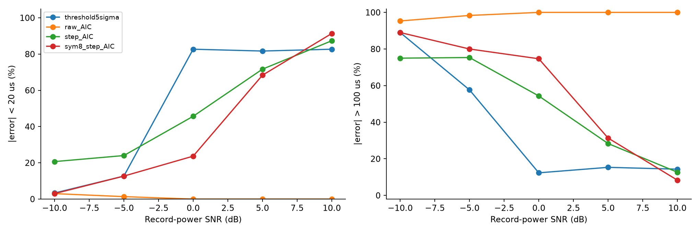
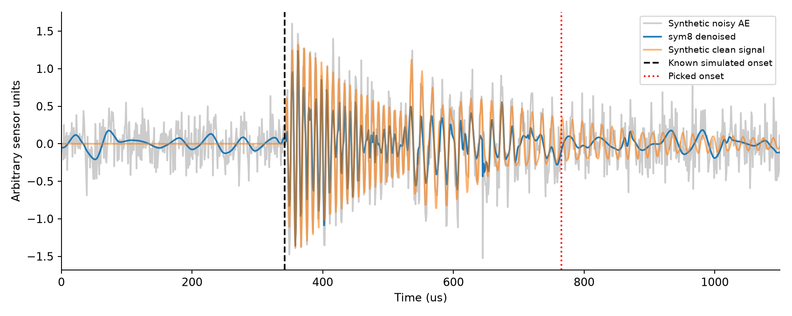
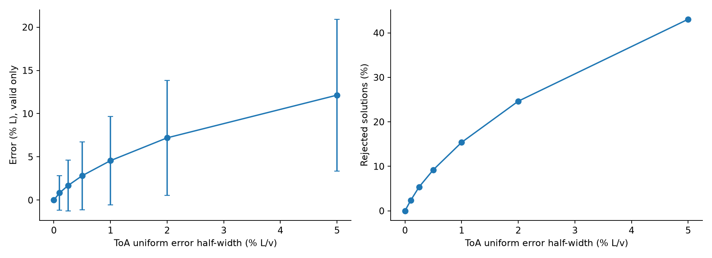
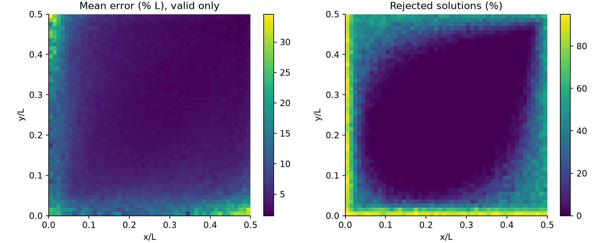
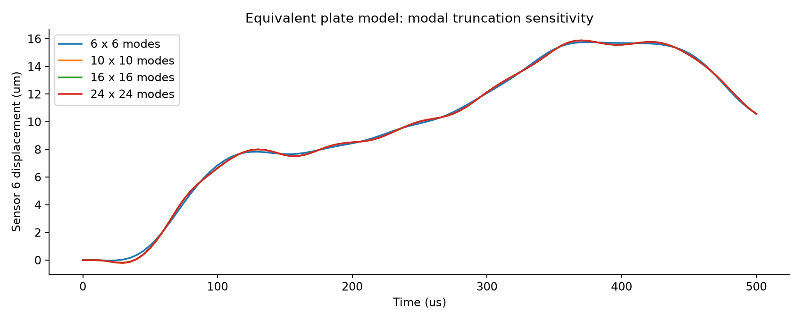
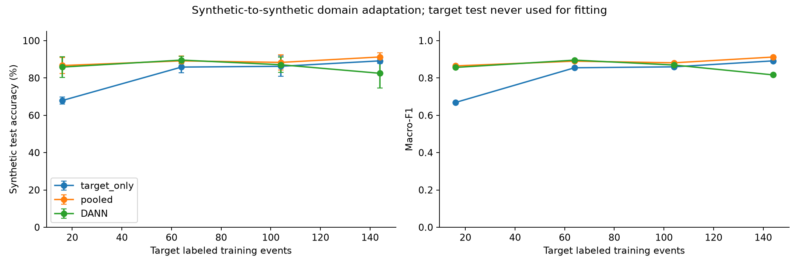
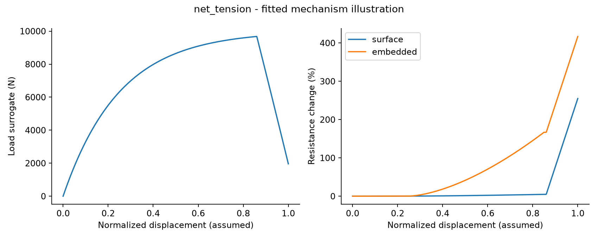
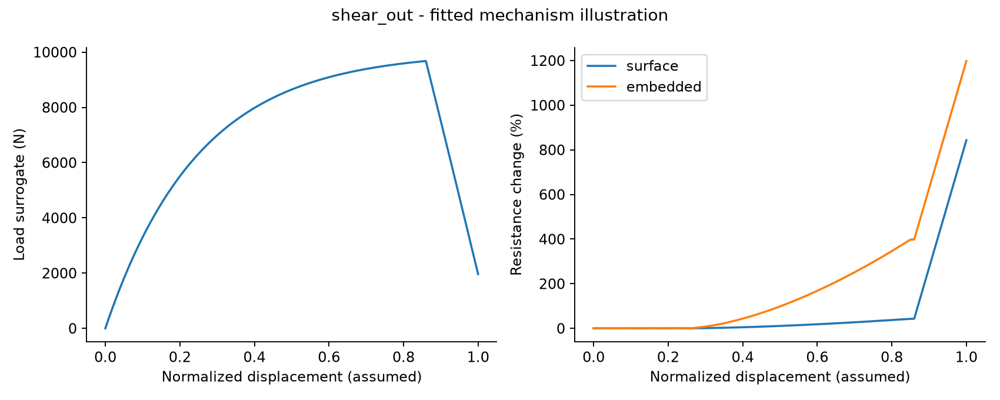
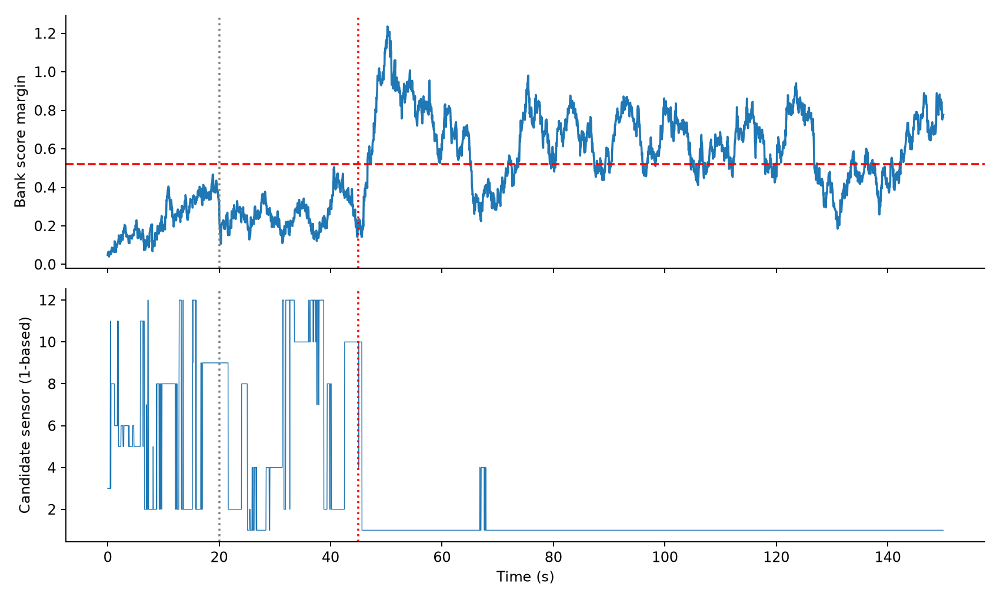

# 前期研究论文实验的仿真复现与毕设衔接

版本日期：2026-09-14。项目根目录：E:\毕设知识库。全文“PDF 第 n 页”均按阅读器页序计数，不是论文印刷页码。

## 1. 结论与复现范围

已经形成并实际运行一套可以检查参数、重跑实验、读取中间数据的复现程序。复现重点是 AE 到达时间、四传感器冲击定位、小样本 CNN-DANN，以及它们与开题报告的数据表征和跨域问题的关系。

目前证据支持：定位方程在理想条件下成立；到达时间误差、传感器几何和各向异性会明显影响定位；源域数据在极少目标样本下可以提供帮助，但域对抗并不始终优于简单混合训练。当前合成 AE 噪声实验没有重现原文的低误拾取率，UGW 简化数据又过于容易分类。这些差异都保留在结果中。

**本包没有完成原文实物试验的定量复现，也没有完成显式蜂窝有限元或真实跨结构迁移。** 更准确的定位是：论文算法的局部数值复现、可运行的简化物理仿真、针对缺失数据的机制实验，以及完整有限元复现的参数清单。

| 编号 | 根目录论文 | 原文主要实验 | 本次完成层次 |
|---|---|---|---|
| P1 | MSSP01.pdf，Hou 等，2025 | CFRP 铅芯折断、噪声条件 ToA 拾取、定位 | sym8 多阈值去噪 + 步长 AIC 的独立实现与合成数据试验 |
| P2 | SMS论文01.pdf，Liu 等，2026 | 蜂窝夹层板落球、ABAQUS、无波速定位 | 同一 TDoA 方程的代数求解、蒙特卡洛、首峰插值、等效薄板响应 |
| P3 | Zhao_2025_Smart_Mater._Struct._34_035017.pdf | 加筋复合板冲击区域/点定位、冲击力、域对抗 | CNN-DANN 冲击区域分类支路；原样本量方案，合成波形 |
| P4 | A_Novel_Method_Using_UGW-Based_FAA-ELM...pdf | 变转速齿轮健康/磨损/裂纹诊断 | TCA 与 180 隐节点 ELM；信号及前处理均有简化 |
| P5 | In_Situ_Monitoring...CB_CNT...pdf | 表贴 CB/CNT 压阻传感器、多失效模式、循环载荷 | 三阶段响应及循环压力的参数化示意 |
| P6 | Embedded_Piezoresistive_Sensor_Network...pdf | 嵌入式 CNT/GNP、表贴对照、CFRP 连接失效 | 表 III 参数锚定与两种集成方式对照示意 |
| P7 | A_Hybrid_Multimodel-Based...Aero_Gas_Turbine.pdf | T-MATS 发动机、LSTM、多滤波器、多阈值 | 12 子滤波器与故障注入的简化状态空间机制实验 |

开题报告题目是“可重用飞行器多层结构小样本监测数据表征与跨结构迁移学习研究”。PDF 第 18—21、25—29 页说明了后续多尺度表征、仿真—实测迁移和 K-shot/未知结构验证需求。7 篇论文提供的是前期方法基础，并非开题报告中所有拟开展试验都已完成。

需要区分三种信号：P1 是被动 AE；P2/P3 是被动冲击响应；P4 是主动 UGW。把被动冲击区域识别做通，并不能直接证明主动导波损伤类型识别或跨材料迁移有效。P5/P6 的电阻变化还属于另一种传感机制，不能直接与 PZT 电压拼接后当作同一物理特征。

## 2. P1：低信噪比 AE 到达时间复现

### 2.1 原文实验与明确参数

出处：P1 PDF 第 6—10 页，式(15)—(21)、表 2、图 9—10；结果讨论见第 10 页及后续结果页。

| 项目 | 原文值 |
|---|---|
| 试件 | 500×500×5 mm，T300/环氧，文中写 [0/90] |
| 传感器坐标/mm | (20,20)、(480,20)、(480,480)、(20,480) |
| 铅芯折断坐标/mm | (120,160)、(100,400)、(250,250)、(300,100)、(380,420) |
| 事件数 | 5 个位置 × 5 次 = 25 次，4 通道，共 100 条波形 |
| 采样 | 1 MHz，内置前置放大器 26 dB |
| 去噪 | sym8，4 层 DWT，软阈值 |
| 噪声 | 在采集信号中加入机械摩擦与随机脉冲噪声 |
| 误拾取 | 误差超过 100 点；1 MHz 下对应 100 μs |

原文报告本方法误拾取率约 3%，开题报告引用其约 94% 的 ToA 误差小于 20 个采样点。它们的真值来自人工判读实测信号，本包真值来自波形发生器，两者不属于同一评估数据集。

### 2.2 实际算法

多阈值：lambda_j = sigma × sqrt(2 ln N) / ln(j+1)，j=1 为最高频细节层。软阈值：sign(c) × max(abs(c)-lambda_j, 0)。这里用前 100 个预触发点的 MAD/0.67449 估计 sigma，保留近似系数，对 4 层细节系数做阈值处理；边界延拓选 symmetric。这些估计与边界处理细节是补充实现，不能假定与原 MATLAB 代码一致。

AIC(k) = k ln Var(x[:k]) + (N-k-1) ln Var(x[k:])。代码以累计和与累计平方和计算方差，与原文递推方差在数学目标上一致；方差加下限以避免 log(0)，排除首尾各 4 点。

每 100 点算一次 AIC，取粗网格差分导数最大位置为初估；在其前后合计 500 点的窗口中用逐点 AIC 求最小值。步长 100 是依据原文 100 点误拾取阈值作出的实现选择，并不是取得了原作者脚本。四个对照为 5σ 阈值、全长原始 AIC、无去噪步长 AIC、sym8+步长 AIC。

没有把 Chen/Jin/Barile 三种原文比较算法重新实现，因此本次对照图不能替代原文的算法排名。

### 2.3 合成实验设计

沿用原文位置和通道数。每个随机种子，每档噪声生成 100 条波形；3 个种子、5 档信噪比，共 1,500 条。每条 2,048 点，1 MHz。

生成器包含因果起振、衰减振荡、二次相位变化和延迟反射。假设平均波速 2,600 m/s，方向项 v(theta)=2600×[1+0.12 cos(2theta)]；源时刻在 220—280 μs 随机变化；主要频率 110 kHz，反射分量 65 kHz。波速、衰减、波包形态、反射时延均为补充假设，未依据真实 CFRP 波形标定。

噪声由高斯白噪声、20 kHz 正弦干扰和每条 6 个随机尖峰构成。SNR 按整条记录的平均功率定义为 10log10(mean(clean²)/mean(noise²))，取 -10、-5、0、5、10 dB。由于记录含长静默段，这不是波包内部 SNR；不能与采用其他 SNR 定义的论文数值直接比较。

指标统计包含所有通道，不事先删除误拾取。300 条/噪声档来自 75 个事件的 4 个通道，不能按 300 个独立试件计算置信区间。保存的 `ae_dataset.npz` 是 seed=0、0 dB 的 100 条示例波形，其余可用固定种子重建；全部 6,000 条方法结果保存在 `ae_trials.json`。

### 2.4 实际结果

{{AE_TABLE}}

10 dB 时，完整方法有 91.33% 的拾取误差小于 20 μs，但误拾取率仍为 8.33%；0 dB 时明显失败。**不能声称复现了原文的 3% 误拾取率。** 全长 AIC 经常选择尾波/噪声段；经过阈值处理后，弱波头也可能被消除，最大 AIC 导数可能被后续变化主导。

额外的 `ae_noise_ablation.json` 固定算法，比较白噪声、摩擦干扰、尖峰及混合噪声；该诊断使用另一组更简单的无反射脉冲，不和主实验混合统计。它仍出现较高失效率，提示问题不只是某一种尖峰噪声，还与输入波包、截取长度和窗口策略有关。由于各组随机实现不同，该诊断是分布级比较，不是严格配对因果消融。

下一步最有价值的数据是原文 100 条 PLB 波形及人工 ToA 标签。拿到后先固定本代码不改参数，评估域外表现，再仅用独立校准集确定 sigma 估计、起振频带和窗口策略。若优化后测试集性能提高，应作为改进方法另列，不能倒称为原文实现。

## 3. P2：蜂窝夹层板冲击定位

### 3.1 原文的结构、传感器和样本量

出处：P2 PDF 第 15—18 页，图 17—21、表 2—4。

板为 400×400 mm；两层蒙皮各 0.5 mm，蜂窝芯高 14 mm，总厚度写为 15 mm。六边形外接圆直径 8 mm、壁厚 0.04 mm；J-47 胶膜厚 0.15 mm。16 个 PZT 构成 4×4 节点、3×3 个监测子区，边界留距 50 mm，传感器间隔 100 mm。

**单个四传感器定位单元边长是 100 mm；300 mm 是整个九子区网络的覆盖边长。** 本包数学实验用单位边长 L，换算到实际子区时应乘以 0.1 m，而不是 0.3 m。

原文落球参数：铝/钨钢；直径 6/8/10 mm；高度 160/250/360 mm；9 个区域，每区随机 10 次，共 9×10×2×3×3=1,620 次。实测试验中 1,600 次有效，20 次人为操作异常。数值仿真也组织 1,620 个工况。

本包已生成同数量的 **待求解工况表**：90 个位置在板坐标中随机布置，任意两点至少相距 10 mm；每个位置组合 18 个球参数。落高转换 v=sqrt(2gh)。这只是建模输入，不是 1,620 次已完成的 FE 计算。

### 3.2 TDoA 数学复现与原算法差别

原文式(5)：norm(p-s_i)-norm(p-s_j)=v×(ToA_i-ToA_j)。四传感器给出三个独立时间差，未知量为 x、y、v；冲击发生的绝对时刻通过时间差消除。

本实现采用同一方程的代数求解，**没有实现原文的五组双曲线交点、波速黄金分割搜索和畸变 ToA 修正分支**。因此是方程级复现和另一求解器验证，不能称为原算法逐步复现。

推导：方形四角相对中心等距，将 d_i²=v²(t_i-t0)² 相减，令 u=p/v²，可得到关于 u_x、u_y、t0 的 3×3 线性系统。随后由任意一个未相减方程得到 q=v² 的二次方程，恢复 p=q u。代码逐根检查正波速、非负传播时间、子区内位置及原始时间方程残差。

没有唯一有效根、矩阵病态或根不满足几何条件的样本标为失败，不用真值选根，也不把失败坐标强行裁剪回板内。对整体 ToA 平移和正比例缩放，位置不变；此性质已经数值检查。

注意：未知数与方程数相等并不保证局部可辨识。中心/对称轴会使方程退化，这是结构几何导致的困难，不能只靠增加网络训练次数解决。

### 3.3 原文已有的误差敏感性实验

出处：P2 PDF 第 10—13 页，式(12)—(13)、图 13—14。沿用 ToA_error=ToA+ell×U(-1,1)，ell 表示 L/v 的比例。每个误差级别随机 100,000 次；空间敏感性沿用 50×50 个点、每点 100 次。

本次误差级别为 0、0.1%、0.25%、0.5%、1%、2%、5%。算法输入不包含生成时的真实波速。输出分为有效样本定位误差、失败比例、全部样本中误差小于 5%L 的比例，避免选择性报告。

{{LOC_TABLE}}

在 1% ToA 扰动下，有效解平均误差 4.564%L，标准差 5.115%L，95 分位 14.426%L，失败 15.391%；全部样本中误差小于 5%L 的比例为 59.882%。若 L=100 mm，有效解平均误差约 4.56 mm。该换算不代表真实蜂窝板实验精度。

原文对同类数学敏感性实验给出约 5%L 的平均误差，趋势相近；但其修正分支与本包拒绝策略不同，不能通过这一接近数值认定完整方法已被复现。原文 0.781 cm（仿真）和 1.340 cm（实测）还包含结构响应、区域识别和 ToA 提取误差，本次数学实验不具备这些误差来源。

### 3.4 首峰插值与各向异性失配

首峰算法按原文 PDF 第 5—6 页实现：AIC 确定起始位置，首个负阈值穿越确定终点，找窗口最大值，并用相邻三点做二次插值。负阈值及单峰信号模型是补充设定。

{{PEAK_TABLE}}

200 kHz、理想平滑首峰和小幅白噪声下，插值平均误差约 0.048 μs，整数点峰值约 1.239 μs。这仅说明亚采样插值在该受控信号中有效，并非 200 kHz 实物采集保证具有 0.048 μs 的到达时间准确度。500 kHz/1 MHz 下误差不单调下降，体现固定幅值噪声对局部曲率估计的影响。

另外保持无采样噪声，令传播速度为 v0[1+e cos(2theta)]，却继续使用各向同性定位器：

{{ANIS_TABLE}}

这组实验把“跨材料/铺层迁移”的一个物理问题单独显现出来：当传播规律改变，定位算法本身的假设已经失配，不能仅把统计对齐后的特征重叠当作正确迁移的证据。

## 4. P2：可运行的结构响应仿真与高保真建模清单

### 4.1 本次实际求解的模型

代码 `plate()` 求解四边简支等效 Kirchhoff 薄板的线性受迫振动，用正弦模态展开和 Newmark 平均加速度法积分：

M_mn q_ddot + 2 zeta omega_mn M_mn q_dot + M_mn omega_mn² q = phi_mn(x0,y0) F(t)。

各向同性等效弯曲刚度 D 仅由上下蒙皮贡献：2E/(1-nu²) × [t_skin³/12 + t_skin((h_core+t_skin)/2)²]；面密度为两层蒙皮加等效芯质量。E=73 GPa、nu=0.33、rho=2780 kg/m³ 来自原文表 3；芯相对密度 0.02、阻尼比 0.015 是假设。

选择 8 mm 钨钢球、落高 0.36 m；质量 3.968 g、初速度 2.658 m/s。假设无反弹，用持续 60 μs 的半正弦载荷使冲量等于 mv，得到约 276.06 N 峰值。接触时间、恢复系数与载荷形状没有实测标定。

计算持续 0.5 ms，输出间隔 5 μs，16 个观测点，与原文采样率/时长对应。**输出是位移（m），不是 PZT 电压，也不是原文传感器应变。** 保存于 `plate_waveforms.npz`。

比较每轴 6、10、16、24 阶模态，对 24×24 模态结果的全通道相对 L2 差分别约为 1.204%、0.0910%、0.0162%、0%。这是模态截断敏感性，不是与真实结构误差，也不是原文的 1—6 mm 网格收敛性。时间步很小但未另外做严格的时间步独立性试验，24×24 也只是本次最高截断阶数。

该模型忽略蜂窝胞元、芯剪切、胶层、局部屈曲、塑性和真实接触；边界由原文固支改成了简支，且采样输出未建立完整抗混叠/电路模型。它适合检查动力响应和数据接口，不能证明冲击损伤或高频导波散射被正确模拟。

### 4.2 原文 ABAQUS 参数及落地步骤

`abaqus_reference_spec.json` 已逐项记录单位、几何、材料、边界、网格及待核实项；本机没有实际调用 ABAQUS/ANSYS，未生成伪装成已收敛结果的求解日志。

| 模块 | 原文参数/做法 | 实施时需要处理 |
|---|---|---|
| 蒙皮/芯 | S4R；蒙皮建议网格 2 mm | 芯壁网格需独立控制；厚度是截面属性，不能把 40 μm 壁误做成实体网格尺寸 |
| 铝材料 | rho 2780；E 73 GPa；nu 0.33 | 原文同时出现 2024-T3 和 pure aluminium 表述，以表 3 数值为可追溯输入 |
| Johnson–Cook | A 325 MPa，B 684 MPa，C 0.0083，n 0.73，m 写为 0，参考应变率 1 | 明确禁用热软化的实现，不要机械计算 1-(T*)^0；补足软件所需温度字段或选相应无热软化配置 |
| 球 | rho 14800，E 530 GPa，nu 0.24（钨钢） | 铝球材料另需确定；球径与落高批量参数化 |
| 传感器 | rho 7600，E 10 GPa，nu 0.36 | 原文按纯弹性建模；需补尺寸、方向、胶接方式及应变提取定义 |
| 连接 | 蒙皮/芯 Tie | 原文基准模型不含可分离界面；要研究脱粘必须另建损伤模型 |
| 约束 | 板周边全部自由度固定；球只沿法向运动 | 检查实体/壳实际存在的自由度，避免重复或过约束 |
| 时程 | 总时长 0.5 ms；历史输出 5 μs | 5 μs 是输出间隔，不是显式稳定积分步长 |

建议按以下顺序实现，避免一次性提交 1,620 个未经校核的作业：

1. 先做 8 mm 钨钢球、0.36 m 落高的单工况；核对模型总质量、接触法向、面内约束和初速度。
2. 用 6/5/4/3/2/1 mm 蒙皮网格比较传感器 6 的应变时程；同时核查芯壁网格和局部接触精度，不只比较峰值。
3. 检查接触穿透、总能量、动能/内能、人工应变能和小时玻璃能；显式冲击不是准静态问题，不能照搬“动能必须远小于内能”的静力判据。
4. 导出每个 PZT 对应面积上的应变平均值，保持相同位置、分量、坐标变换、采样和时间零点。若要得到电压，应增加经标定的压电/测量传递模型。
5. 校核一个实测工况后再扩展到 `hsp_1620_planned_cases.json`；失败作业保留原因与质量标记。
6. 若研究分层/脱粘，以原文 Tie 健康基准另建 cohesive 接口和损伤标签，原文 JC 参数不能替代 CFRP 分层/层内失效参数。

原文 nominal 15 mm 厚度与两层 0.15 mm 胶膜存在几何口径问题：若胶层作为独立实体加入，总厚度会增加 0.3 mm。应先确定论文 FE 模型是否通过 Tie/壳偏置隐含处理胶层，不能在复现中默默同时加入。

## 5. P3：CNN-DANN 小样本迁移

### 5.1 对齐原文的实验设置

出处：P3 PDF 第 9—11 页，表 1—2、图 8—10。

原文试件约 1000×1000×2 mm、16 层编织碳纤维、带 T 形加强筋。源域和目标域位于同一试件不同区域，并非两个不同材料结构。每域 8 个 250×250 mm 子区；传感器间距 400 mm×200 mm。PZT 采样 25 kHz，每事件 4 通道、300 点、12 ms。

| 每类目标样本 K | 源域训练 | 目标域训练 | 目标域测试 | 原文无迁移正确数/80 | 原文迁移正确数/80 |
|---|---|---|---|---|---|
| 2 | 200 | 16 | 80 | 22/80 = 27.50% | 63/80 = 78.75% |
| 8 | 200 | 64 | 80 | 59/80 = 73.75% | 77/80 = 96.25% |
| 13 | 200 | 104 | 80 | 70/80 = 87.50% | 78/80 = 97.50% |
| 18 | 200 | 144 | 80 | 74/80 = 92.50% | 80/80 = 100% |

以上是直接核对原图后的文献值，不是本次运行结果。

### 5.2 本次信号、网络和训练

本次按 1.0×0.5 m 的域内矩形、4×2 个子区生成位置；传感器域内坐标设为 (0.3,0.15)、(0.7,0.15)、(0.3,0.35)、(0.7,0.35) m，符合 400×200 mm 间距，但其绝对位置及域内坐标方向是补充设计。

信号为距离衰减、延迟、多频衰减振荡及通道噪声。源域频率取 1833/1083/583/333 Hz，目标域取 1416/833/500/333 Hz，数值来自原文 PDF 第 14 页表 5 的 IMF 中心频率。**把这些中心频率用于生成器，不等于复现了 VMD，也不代表原波形可由四个正弦精确重建。** 源/目标平均波速分别假设 800/700 m/s，另加方向项和通道增益。

网络保留原文的三层卷积核 5×5、3×3、5×5；任务头为 512→8，域头为 1024→1024→2。原文没有在表中给全卷积通道数、padding、pooling 和输入图像构造，因此本次补为：输入 [N,1,4,300]，通道 8/16/32，padding 保持空间大小，时间方向平均池化 4 倍、3 倍，再自适应池化到 2×4；ReLU，展平 256 维。

输入为“传感器×时间”二维矩阵，卷积跨越传感器行是人为邻接假设。没有声称实现了原文所引用文献的完整输入图像构造。网络结构、优化设置和数据都不同，因此只能称 CNN-DANN 框架复现。

监督损失：L_task = 0.5 CE_source + 0.5 CE_target；DANN 再训练域分类器，域特征梯度经 GRL 变号。lambda(p)=0.1×[2/(1+exp(-10p))-1]。优化器 Adam，学习率 0.001，weight_decay=1e-4，80 epoch，梯度范数截断 5，全批量训练。以上优化参数是本次固定假设，没有用目标测试集选 epoch 或调参。

每个种子分别生成 200 个源训练事件、144 个目标训练池事件、80 个独立目标测试事件。目标 K 样本是同一训练池每类的前 K 个，较小 K 是较大 K 的子集。归一化均值/标准差仅用源训练数据拟合并冻结；所以 `target_only` 指只使用目标标签训练，但仍共享源训练得到的标量归一化，不是完全不接触源数据的严格基线。

对照包括源域直接测试、只用目标标签、源/目标混合监督训练、DANN。每个种子训练 1+4×3=13 个模型，共 39 个。测试事件、通道及其标签没有进入训练或域对齐。保存每个 seed 的数组、独立事件 ID、3 个 K=8/seed=0 的模型权重、训练损失和混淆矩阵。

### 5.3 本次运行结果

{{TRANSFER_TABLE}}

数值为 3 个种子的均值±种子间样本标准差，不是置信区间，也不是统计显著性结论。只报告 Accuracy 不足以说明不同类别都改善，Macro-F1 和逐 seed 混淆矩阵已保存在 JSON。

目标域只有 16 个样本时，DANN 平均准确率 85.00%，目标标签训练为 67.08%，混合监督为 84.17%。这支持“源域数据在极少目标样本条件下有用”，但尚不能证明增益主要来自域对抗：DANN 比混合监督只高约 0.83 个百分点。

目标域 64 个样本时，DANN 为 85.83%，混合监督为 87.50%；目标域 104 个样本时，DANN 为 82.50%，目标标签训练为 87.08%。本合成问题上存在负迁移，未出现原文“各样本规模均明显提升”的结果，不能选择性隐藏。

原文另一条支路是 VMD→TCN→GRU 冲击力估计（PDF 第 12—16 页），并用 DTW 加权中心做精确点定位（PDF 第 8、11—13 页）。本次没有实现这两条支路，保存的标签也不含实测冲击力；CNN 分类模型不能宣称估计了冲击力峰值或厘米级坐标。

## 6. P4：变工况 UGW 与 FAA-ELM

### 6.1 原文实验

出处：P4 PDF 第 3—9 页，算法 1、图 5—15。

五档转速 0/150/200/250/300 r/min，扭矩 25 N·m；健康、齿面磨损、齿根裂纹三类，磨损减薄 1.5 mm、裂纹 4 mm。原文激励中心 350 kHz、幅度 70 V、采样率 24 MHz、330—370 kHz 带通。原链路为 CEEMDAN→MWF-PeEn→PCA→TCA→ELM；ELM 最优设置为 180 隐节点、tanh。

原文称源域训练 486 个样本，其余四工况测试集“containing 324 samples”的口径需要原作者数据进一步澄清。本次采用四工况合计 324 个的解释，并明确没有按其准确率反推样本数。

### 6.2 实现和局限

生成 24 MHz、250 μs 的主动波包：裂纹主要改变直达波包，磨损主要改变反射波包，叠加 18 mV 噪声和转速相关小延时；这些散射变化为假设，没有从 4 mm 裂纹几何求解得到。

本次使用 330—370 kHz Butterworth 带通、8 时间窗均值/RMS/峰值/标准差及频带统计，**没有实现 CEEMDAN、MWF-PeEn 和 PCA 前处理，因此不能把输出称作完整 FAA-ELM 复现。** `core.py` 中的 TCA 是线性核原空间形式，以广义特征值问题求解；ELM 保留 180 隐节点/tanh，岭系数设为 1。

每目标转速的 81 个样本中，27 个作为无标签适配池，54 个作为独立测试。TCA 不读取测试输入或标签；因此本包的 216 个最终测试样本与原文 324 个测试样本口径不同。源域直接 ELM 与 TCA-ELM 使用同一留出测试集。

{{GEAR_TABLE}}

原文四工况准确率为 93.06%、91.67%、94.44%、90.28%，平均 92.36%。本次结果接近满分，**不是比原文更好，而是合成类别过于容易区分**；不能据此证明 TCA 必要。本实验的价值是验证程序接口和无测试泄漏的统计对齐流程。

原文重复性/稳定性 K–W 检验的 P 值不应从合成波形“凑”出来，也不能把同条波形的连续时间点当作独立试验重复。本包没有冒充复现这些 P 值。完整复现还需多次原始采样、转速工况归属、MWF-PeEn 窗口/尺度/嵌入参数及 CEEMDAN 配置。

## 7. P5/P6：CFRP 连接压阻监测

### 7.1 原文可直接继承的实验条件

P5（表贴 CB/CNT）：PDF 第 6—8 页，图 13—19。原文考察分散剂比例和导电填料，采用 0.5 wt.% SDBS；循环压力 1600 kPa，约 350 s 的稳定性测试，电阻变化幅度约 30%。净拉伸、剪切挤出、承压三类连接失效分别呈现不同电阻变化过程。

P6（嵌入 CNT/GNP）：PDF 第 5—6 页给出 135×36×3 mm 试件、6 mm 孔径、拉伸速率 5 mm/min。三种铺层为净拉伸 [0/0/90/0/0]2s、剪切挤出 [90/90/0/90/90]2s、承压 [90/45/0/-45/0]2s。循环压力 640 kPa；固定温湿度下长期稳定测试约 100,000 s。传感材料为 CNT/GNP，不能与 P5 的 CB/CNT 配方混写。

P6 PDF 第 11 页表 III 的第二阶段电阻变化幅度：

| 模式 | 表贴 | 嵌入 |
|---|---|---|
| 净拉伸 | 4% | 166% |
| 剪切挤出 | 42% | 397% |
| 承压 | 缺失/失效，表中为横线 | 37% |

37% 是变化幅度；图 24 中嵌入式承压响应主要为负向变化，不能把表中正数直接解释为电阻一直增加。本包保留承压负向趋势；表贴承压失效后设 NaN，不当成零电阻变化。

### 7.2 本次只实现了现象模型

以归一化位移 u∈[0,1] 定义损伤进程 D(u)=clip((u-0.25)/0.6,0,1)^1.6，再将表 III 幅值作为电阻模型的输入系数；第三阶段增加导电网络断裂项。载荷曲线是任意设置的平滑增载/软化示意，不是根据 CFRP 本构推出来的承载能力。

循环压力示意采用 10 s 周期和 0.5 s 一阶响应时间常数，这是明确假设；压力峰值 1600 kPa、平衡电阻变化 30% 来自 P5。没有重现传感器制造、SEM/XRD、真实循环耐久性或 100,000 s 的稳定性实测。

**这些曲线属于原文参数锚定的演示，不是独立预测。** 用原文的 166%/397% 设置模型，再得到相似幅值，不能作为仿真验证。它们目前只适合作为传感器信号机制示例，不能直接拿来训练并验证损伤识别准确率。

要完成力学—电学联合仿真，至少需：T300 单层工程常数 E1/E2/G12/G13/G23/nu12；拉压强度、剪切强度和断裂能；孔边接触/摩擦/螺栓预紧；胶层与绝缘层性质；传感器厚度/位置/初始电阻及独立测得的 R—应变—压力关系。然后用层内损伤与 cohesive 分层模拟破坏，再由独立标定的隧穿/渗流电阻模型预测响应。须留出另一批试件验证，不能同时用同一曲线标定与验收。

## 8. P7：多模型状态监测与传感器故障

出处：P7 PDF 第 3—9 页，式(17)—(21)、图 13—17。原研究包含涡轴发动机故障分类和 JT9D 多阈值传感故障诊断两个模型，不能把两者简化成同一个真实发动机。原文使用 NASA T-MATS/Simulink，时间步 0.04 s，归一化后高斯噪声标准差 0.05；一个示例在 20 s 注入 -1% 性能变化，45 s 注入传感器 1 的 +5% 偏置。

本次保留 12 通道、逐一剔除通道的 12 个 Kalman 子滤波器、相同时间步/噪声量级/注入时刻，状态仅用两个潜变量和显式给定观测矩阵构造。没有发动机部件特性图、热力平衡、控制回路和 LSTM 故障分类，因此不是 JT9D 仿真。

每个子滤波器对其保留的 11 个通道计算创新二次型，再对分数作 5 s 滚动平均，用分数最小的排除假设选传感器。报警阈值由独立健康噪声样本的分数差 99.5% 分位数获得。该滚动分数差并非原文完整 WSSR/IWSSR 双阈值算法，校准样本也没有完整滤波动态，正式应用仍需独立健康过程校准。

本次输出：5—20 s 健康片段误报比例 0%；50 s 以后报警覆盖率 70.96%；同区间候选传感器识别为 1 号的比例 99.28%。后一个指标是持续候选识别率，**不是报警事件级准确率，也不是首次检出时刻**；未复现原文 124 s 移除故障传感器的结果。

对毕设而言，更可迁移的是“把结构变化与通道故障分开”的实验设计，而不是发动机的具体阈值。在 PZT 数据中，应分别注入波形增益/漂移/断线等传感异常和结构损伤，保留独立标签；否则迁移网络可能把传感器失效误学成材料损伤。

## 9. 与毕设直接衔接的下一轮实验

下表是**建议开展、当前未执行**的正式毕设实验，不与前面已运行结果混写。

| 阶段 | 输入与任务 | 对照和验收 | 当前缺口 |
|---|---|---|---|
| 健康导波基准 | 一种层合板，固定 PZT 路径，主动激励 | 波包到达、幅值/频谱、网格和时间步独立性 | 单层材料/铺层、胶层、实测健康波形 |
| 损伤源域 | 分层/脱粘的位置与程度 | 同材料独立试件留出；损伤与温度/传感器故障分离 | cohesive/层内损伤标定与真实标签 |
| 小样本 | 每类 K=1/2/4/8 | 源域直接、目标训练、混合监督、微调、TCA/CORAL/DANN | 当前 P3 的 K=2/8/13/18 是论文设置，尚未执行完整毕设 K 列表 |
| 仿真—实测 | 同一结构的 FE 与真实 PZT 波形 | 原始时序、ToA、频带能量、多尺度表征消融 | 本包无真实波形；synthetic-to-synthetic 不等于 Sim-to-Real |
| 跨结构 | 层合板→加筋板→蜂窝板/连接结构 | 按结构或试件划分；报告结构属性差异 | 目前只是两组假设传播域，不是三个真实结构 |
| K=0 未知结构 | 目标结构完全不参与拟合 | 留一结构；测试域不能用于归一化/TCA/GRL/选参 | 当前源域直接测试只是合成域基线，尚非完整多结构留一验证 |

推荐先把 P2 的 ToA 误差敏感性与 P1 的实际 ToA 误差分布接起来，但不能直接把 AE 拾取器用于 HSP 主波包首峰：两者的到达定义不同。应先针对主动导波定义“所研究模式的波包到达”，再评估提取误差如何传播到损伤定位/识别。

对迁移方法，保留混合监督基线很重要：本次 DANN 在 K=13 时低于目标训练，说明“模型带迁移模块”本身不是优势证据。建议用独立源域验证集/少量目标验证集确定对抗权重，按种子记录增益和负迁移比例；目标测试数据一直封存。

## 10. 可重复性、数据与检查

本包只读取根目录的 7 篇论文与 1 份开题报告。`source_inventory.json` 保存文件名和 SHA-256；没有把“参考文献”文件夹中的论文当作本轮实验基础。

已通过的数值检查：自实现小波无阈值完美重构；sym8 常数与 PyWavelets 一致；AIC 累计方差与直接方差一致；无噪声随机位置恢复；ToA 平移/缩放不变性；中心奇异情况正确拒绝；TCA 广义特征向量约束；PyTorch GRL 梯度符号。它们说明关键计算满足其定义，不代表物理模型已经过实验验证。

绘图、指标、标签、种子、网络权重均在 `results` 中。`requirements-lock.txt` 与 `environment.json` 记录实际版本。默认全量命令见 README；报告由 `build_report.py` 将实际 JSON 指标插入生成，不依赖手动重画结果。

本轮没有做参数搜索，也没有用测试曲线选择最优训练轮次。3 个种子仅足以给出初步稳定性观察，不能据此推断统计显著性。所有合成结果用于检查方法与暴露问题，正式学位论文应把它们放在“数值方法验证/前期仿真探索”中，另行给出真实结构与实测验证。

## 11. 原文定位及实现参考

- P1：`MSSP01.pdf`，PDF 第 6—10 页的算法和试验参数；DOI 10.1016/j.ymssp.2025.113080。其去噪与改进 AIC 的方法定位亦核对了[期刊出版社页面](https://www.sciencedirect.com/science/article/pii/S0888327025007812)。
- P2：`SMS论文01.pdf`，PDF 第 5—18 页的方法、统计实验及 FE 参数；附录 A/B 位于 PDF 第 28—33 页；DOI 10.1088/1361-665X/ae7f55。
- P3：`Zhao_2025_Smart_Mater._Struct._34_035017.pdf`，PDF 第 8—16 页；DOI 10.1088/1361-665X/adb405。
- P4：`A_Novel_Method_Using_UGW-Based_FAA-ELM_for_Wind_Turbine_Gearbox_Health_Monitoring_and_Fault_Diagnosis_Under_Variable_Working_Conditions.pdf`，PDF 第 3—9 页。
- P5：`In_Situ_Monitoring_of_Failure_Modes_in_Composite_Bolted_Joint_Structures_Using_CB_CNT_Piezoresistive_Sensor.pdf`，PDF 第 6—8 页。
- P6：`Embedded_Piezoresistive_Sensor_Network_for_Multi-Failure_Mode_Monitoring_in_CFRP_Bolted_Joints.pdf`，PDF 第 5—6、11 页。
- P7：`A_Hybrid_Multimodel-Based_Condition_Monitoring_and_Sensor_Fault_Detection_Method_for_Aero_Gas_Turbine.pdf`，PDF 第 3—9 页。
- sym8 数值常数核对：[PyWavelets 官方源文件](https://github.com/PyWavelets/pywt/blob/main/pywt/_extensions/c/wavelets_coeffs.template.h)。正式 AE 实验调用已安装的 PyWavelets，自实现 DWT 仅作为可核查数值内核保留。
